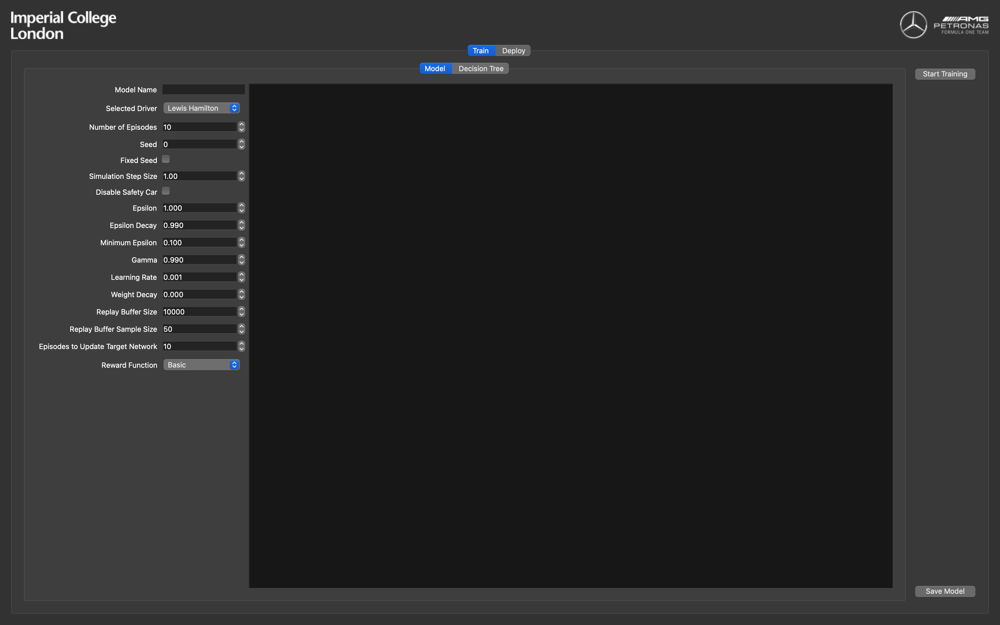
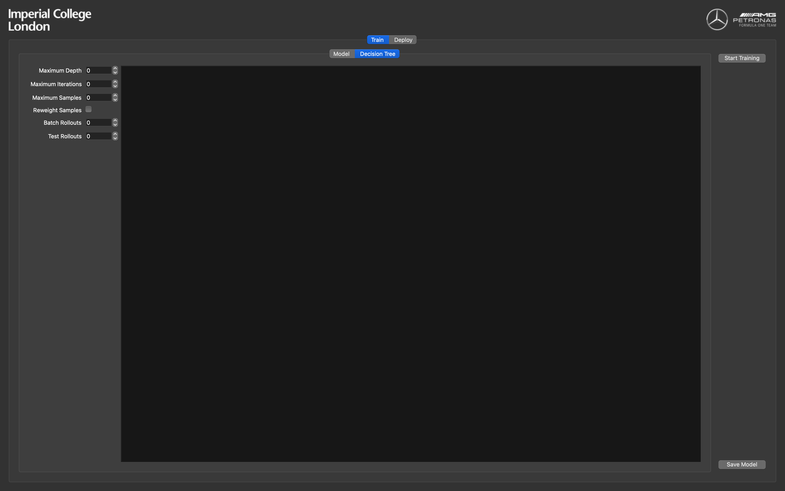
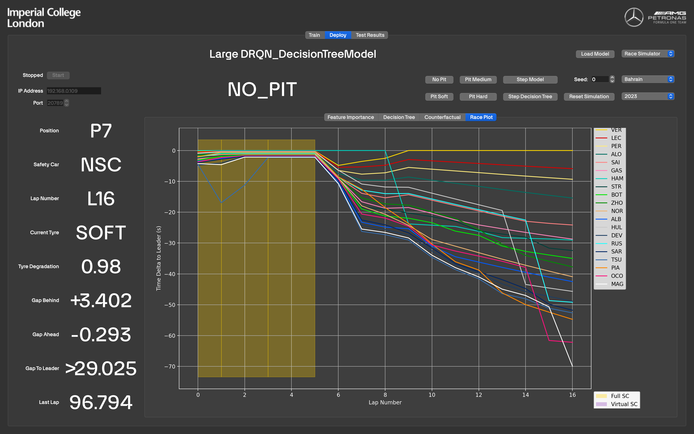
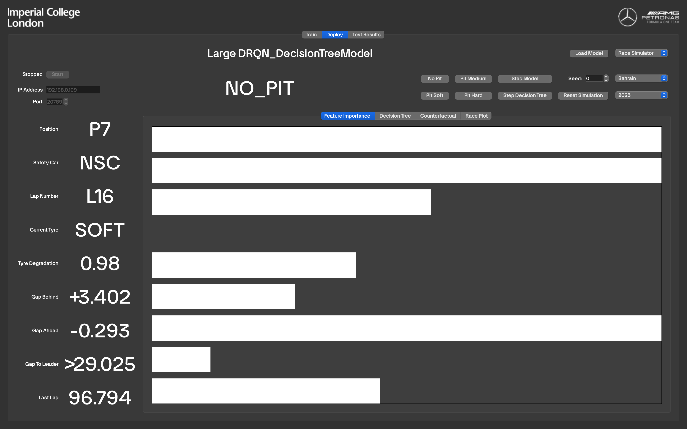
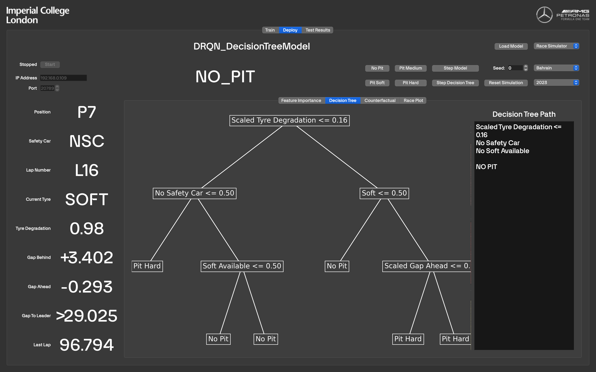
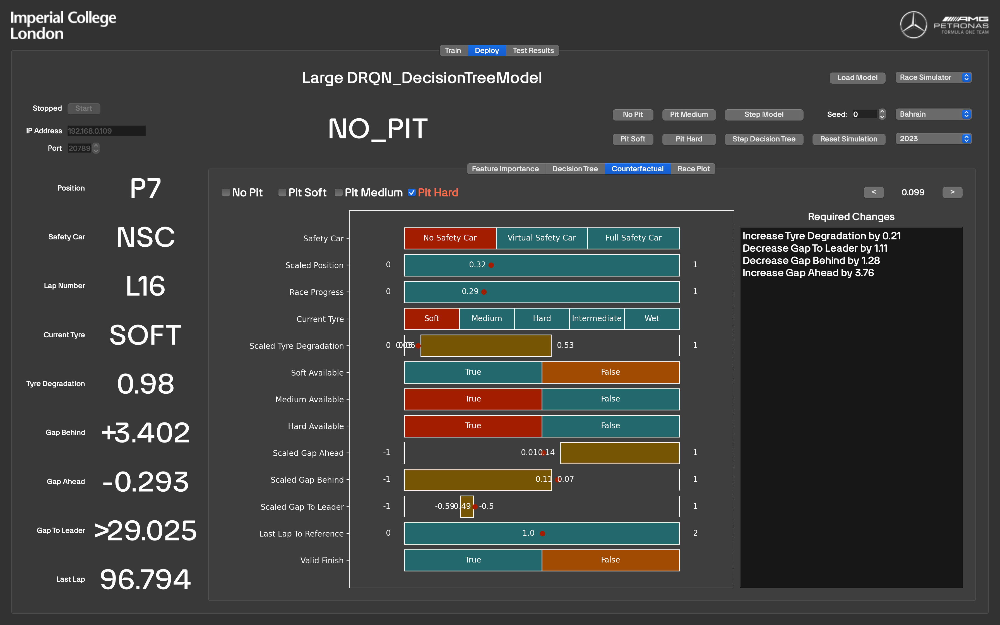
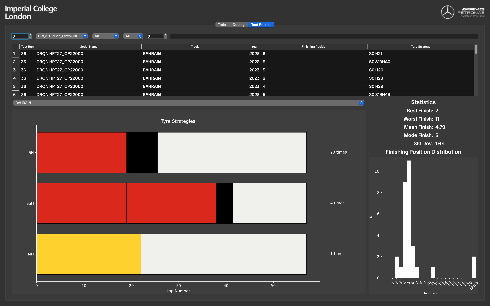

# Explainable Reinforcement Learning for Formula One Race Strategy

This repository contains the code for the project "Race Strategy Reinforcement Learning: Optimising Pitstop Strategy with Emergent Tactics".

Thanks goes to the following people from Imperial College London and Kings College London for their help and support:

- Dr. Antonio Rago
- Dr. Francesco Belardinelli
- Mr. Junqi Jiang
- Mr. Avinash Kori

This project would not be possible without the support of Mercedes-AMG Petronas Formula One Team, and the following people in particular:

- Mr. Joseph McMillan
- Dr. Stuart Sale
- Mr. Steffen Winkler.


## GUI

To run the GUI, simply run

```
bash run_gui.sh
```

### Model Training
The GUI allows for model training, however this feature is not completely implemented due to the transition to using HPC services for training, instead of the local machine. Here, models and their surrogate decision trees can be trained.

#### Model Training


#### Decision Tree Training


### Model Deployment
Trained models can be deployed with use against different data sources.

#### Race Plot
The current race can be visualised in a Gap to Leader Plot.


#### Feature Importance
To understand which features are most important to the model's current decision, a feature importance plot can be generated.


#### Decision Tree
Using VIPER, we can train a surrogate decision tree to mimic the behaviour of the original model. This tree tells us how the model is likely reaching its decisions using hard boundaries. The tree can be visualised as seen below.


#### Decision Tree Counterfactual
Suppose we want to understand why the model has taken a 'Pit Soft' decision instead of a 'Pit Medium' decision. We can the Decision Tree Counterfactual to understand why the model has not made another decision. Shown graphically and textually, the exact changes required to the race state are outlined in order to have the model give an alternate prediction.



### Test Visualisation
When models have been tested, their test results are saved and can be viewed in the test screen seen below.

Recorded results can be filtered using the dropdowns provided. Tyre strategies can also be filtered with the following rules with spaces between:
- `=n` – Only show n-stop strategies
- `>n` – Only show strategies with more than n stops
- `<n` – Only show strategies with fewer than n stops
- `[S,M,H,I,W,X][m, [a,b], _]` – Only show strategies with the specified tyre compounds on specified lap numbers. `X` is a wildcard for any compound. `_` is a wildcard for any lap number. 

For example, `=2 S0 X5 M_ H[25,30]` will find all strategies with two pitstops; starting on the Soft tyre; pitting to any tyre on lap 5; pitting to the Medium on any lap; and pitting to the Hard tyre between laps 25 and 30.


## Tests

To run the tests, simply run

```
bash run_test_models.sh
```

Alternatively, you can run the tests manually by running

```
python test_models.py
```

with the following flags

```
usage: test_models.py [-h] [--num_tests NUM_TESTS] [--with_mercedes] [--with_fixed] [--models [MODELS ...]] [--verbose] [--years YEARS [YEARS ...]] [--tracks TRACKS [TRACKS ...]]
                      [--seed SEED] [--disable_safety_car] [--plot_histograms] [--plot_strategies]

options:
  -h, --help            show this help message and exit
  --num_tests NUM_TESTS, -n NUM_TESTS
                        Number of tests to run
  --with_mercedes, -m   Whether to include the Mercedes model for comparison
  --with_fixed, -f      Whether to include the Fixed Strategy model for comparison
  --models [MODELS ...]
                        List of models to load
  --verbose, -v         Whether to print progress to stdout
  --years YEARS [YEARS ...], -y YEARS [YEARS ...]
                        List of years to allow
  --tracks TRACKS [TRACKS ...], -t TRACKS [TRACKS ...]
                        List of tracks to allow
  --seed SEED, -s SEED  Seed for random number generation
  --disable_safety_car, -d
                        Whether to disable the safety car in simulations
  --plot_histograms, -ph
                        Whether to plot histograms of the results
  --plot_strategies, -ps
                        Whether to plot the tyre strategies
```

An example execution would be

```
python test_models.py \
    --seed 0 \
    --num_tests 10 \
    --years 2023 \
    --tracks \
        BAHRAIN AZERBAIJAN UK HUNGARY BELGIUM ITALY SINGAPORE JAPAN QATAR ABU_DHABI SPAIN SAUDI_ARABIA AUSTRIA MEXICO USA \
    --models \
        "Saved Models/Max DRQN General Model.pth" \
        "Saved Models/Max_DRQN_25_22.pth" \ 
        "Saved Models/Mid_DRQN_DecisionTreeModel.pth" \
    --with_mercedes
    --with_fixed
    --disable_safety_car
```
